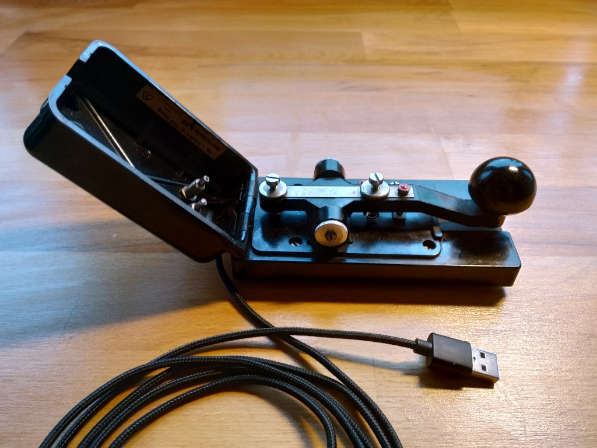

# MorseBoard

This implements a USB-Keyboard using a standard Morse key. The morse key is wired to DigiSpark board that connects to a host machine as a USB HID keyboard.

   
I got the idea after watching a Mixtela video of his implementation on YouTube:

https://www.youtube.com/watch?v=tUNjKQWjo80

I have taken a look at his code before writing my own but apart from the basic idea there is not much similarity.

My version uses a DigiSpark board, the Arduino ecosystem and the DigiKeyboard libary.
  
To be specific it is an enhanced fork of the DigiKey library by Djanovic:
  
https://hackaday.io/page/6947-digikeyboard-with-leds
https://github.com/Danjovic/DigistumpArduino/tree/master/digistump-avr/libraries/DigisparkKeyboard
  
His fork supports reading of the host keyboard status values NUM_LOCK, NUM_LOCK and SCROLL_LOCK. These are used here to enable or disable sound and morse-decoding.
  
* Num-Lock:    Toggle Buzzer
* Scroll-Lock: Toggle Decoder

The hardware consist of the DigiSpark board, a Piezo-Buzzer snapped off a dead PC mainboard and a not-quite antique Morse Key acquired from eBay.

The Morse key is put between a GPIO-Pin and Ground with a current limiting resistor in series.

The Piezo-Buzzer is put between another pin and Ground directly.

The DigiSpark board fits nicely into the base of my Morse key and I got a braided USB-cable that fits the vintage look of the Morse key. 

There is nothing particularly clever about the code but it is very rewarding to plug the thing into an USB port and buzz away...
